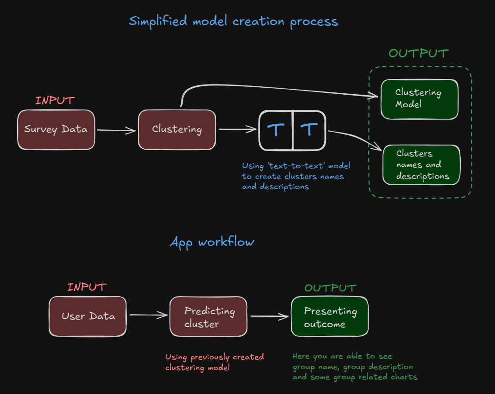

# Alike

Imagine answering a few simple questions: your age, education, favorite pet, favorite place to spend free time, and gender.

**Alike** takes this small set of information and instantly places you in a group of people with similar interests.
You can see who else belongs to your group, explore distributions of age, education, pets, and favorite places, and even compare yourself to the rest of the participants.

Try it yourself here: [Alike](https://bealike.streamlit.app/)  
Or check it here: [GitHub](https://github.com/pawelkowalik2/Alike)

---

# How it’s made

Alike is powered by a full **end-to-end data pipeline** that transforms survey inputs into meaningful insights:

- **Data Collection**: Users provide basic survey information (age, education, favorite pet, favorite place, gender).
- **Clustering**: The pipeline predicts which of 8 clusters each participant belongs to using **PyCaret**.
- **Cluster Names and Descriptions**: Each cluster is enriched with **human-readable names and descriptions**, generated automatically using a **language model (LLM)**.
- **Interactive Visualization**: Results are displayed in **Streamlit**, with **Plotly** histograms showing distributions of age, education, pets, favorite places, and gender within each cluster.
- **Exploratory Analysis**: All survey data can be explored using **YData Profiling**, embedded directly in the app.

This combination of **automatic grouping based on patterns in the data**, **generative AI for cluster descriptions**, and **interactive visualization** highlights the full data product lifecycle, from raw survey responses to actionable, user-friendly insights.

---

### Schema
