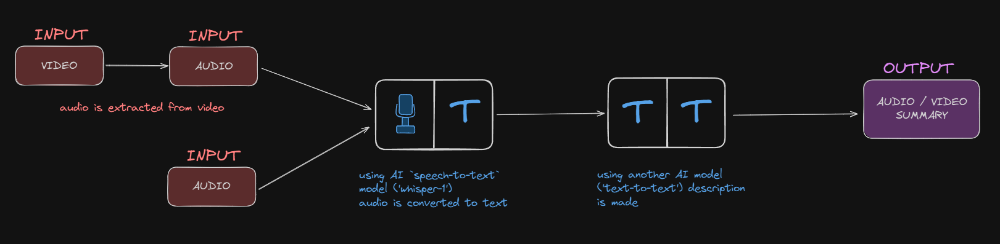

# Essenza

Essenza creates perfect summaries of any audio or video you upload.
It also provides full transcriptions of your files.
Additionally, you can record yourself directly with your microphone to test the app, even if you don’t have an audio or video file at hand.

Try it yourself here: [Essenza](https://essenza.streamlit.app/)

Or check it here: [GitHub](https://github.com/pawelkowalik2/Essenza)

---

# How it's made

This app lets you record your voice or upload audio and video files to generate full transcriptions and concise summaries.
If a video file is uploaded, the audio track is automatically extracted using **pydub** and **BytesIO**.

Audio can be recorded directly in the browser thanks to **audiorecorder**, and all files are handled in memory using **BytesIO** without the need to save them locally.
Checksums are computed using **hashlib (md5)** to detect changes and avoid reprocessing the same audio.

The transcription is performed by **OpenAI’s Whisper model**, while summaries are generated using **GPT-4o-mini**, both accessed through the **openai** library.
The web interface is built with **Streamlit**, which provides an interactive and responsive experience for uploading, recording, and playing audio, as well as displaying the resulting transcriptions and summaries.

Users need to provide their **OpenAI API key** to securely access the AI services.

---

### Schema:
