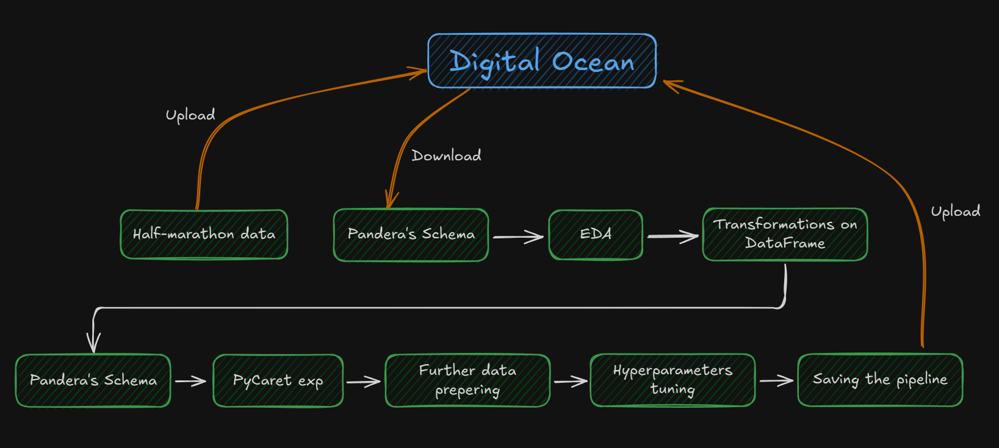
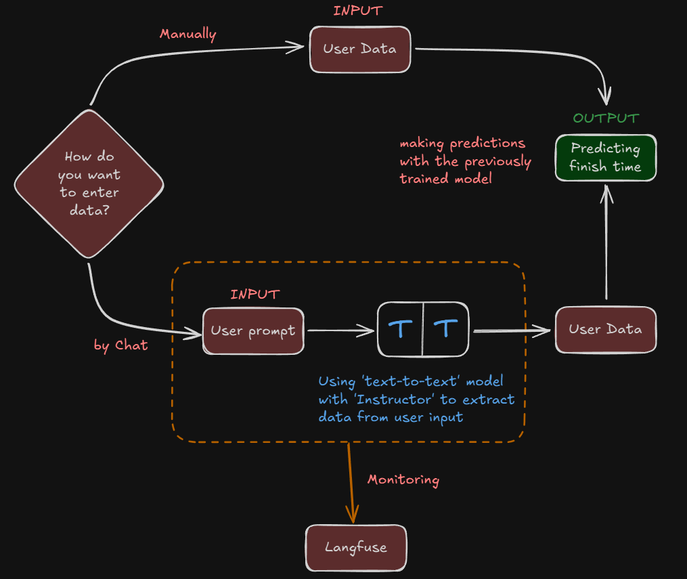

# Runner

Runner helps you estimate your half-marathon finish time based on your personal basic information.  
You can either enter your information manually or simply chat with the app to provide your name, year of birth, gender, and 5 km run time.

Try it yourself here: [Runner](https://clownfish-app-cyomx.ondigitalocean.app/)

Or check it here: [GitHub](https://github.com/pawelkowalik2/Runner)

---

# How it's made
### First Things First – Pipeline

The main goal of this app is to **predict your half-marathon finish time**. To achieve this, I needed to create a proper **pipeline**.  

For this purpose, I used Wrocław half-marathon **data** from 2023 and 2024, which were uploaded to my **DigitalOcean bucket**. 
I also used **Pandera** to create schemas for both the raw data and the data after transformations, right before starting the **PyCaret** experiment.  

After performing proper **EDA**, 
I applied necessary **transformations** to prepare the data for the next step: creating the experiment.  

I also tried to tune the experiment using normalization and additional transformations, 
but the results were worse than the original, so I decided to discard those changes.

For the prediction, I used PyCaret’s **regression model**.

### Creating the App

After preparing the model and pipeline, the next step was to build a user-friendly application. 
I used **Streamlit** to create an interactive interface where users can provide their data and get predictions.  

The app allows users to enter information in two ways:  
1. **Manual Input:** Users can select their gender, enter their birth year, and provide their 5 km time.
2. **Chat Interface:** Users can simply type a message, and a simple **AI assistant** (powered by OpenAI and monitored by Langfuse) 
extracts the necessary informations. This allows for a more natural interaction.

Once the data is collected, it is transformed into the required format and passed to the **trained PyCaret model**. 
The app then predicts the user's half-marathon finish time and displays it in a readable HH:MM:SS format.  

The combination of a **robust ML pipeline** and a **streamlined, interactive interface** ensures that predictions are accurate, reliable, 
and easy to access for anyone interested in estimating their half-marathon performance.

---

### Schemas
Pipeline:

App:

